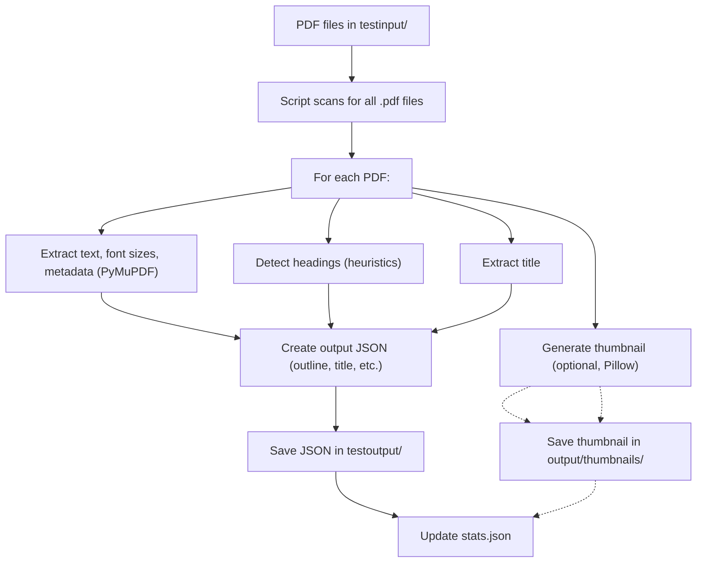

# 🧠 Approach & Model Details

## Overview

This project extracts structured outlines (headings, title, etc.) from PDF documents in a fully offline, efficient, and explainable manner. The approach leverages robust open-source libraries and well-crafted heuristics, rather than deep learning or black-box AI models, to ensure transparency, speed, and reliability.

---

## 1. Models & Libraries Used

### 1.1 PyMuPDF (`fitz`)

- **Purpose:** Core PDF parsing and text extraction
- **Role in Pipeline:**
  - Reads PDF files page by page
  - Extracts text blocks, font sizes, font styles (bold/italic), and metadata (title, author, etc.)
  - Provides bounding box information for layout analysis
- **Why Chosen:** Fast, lightweight, and provides detailed access to PDF internals, including font and layout data, which is essential for heuristic-based heading detection
- **Used For:** All PDFs processed by the script

### 1.2 Pillow (`PIL`)

- **Purpose:** Image processing and thumbnail generation
- **Role in Pipeline:**
  - Converts the first page of each PDF into a JPEG thumbnail (if enabled)
  - Handles image resizing and saving
- **Why Chosen:** Standard for image processing in Python, with excellent support for various formats
- **Used For:** Any PDF where the `--thumbnails` flag is set

### 1.3 NumPy

- **Purpose:** Statistical analysis
- **Role in Pipeline:**
  - Calculates the most common font size across the first few pages to determine the "body text" size
  - Supports efficient computation for font size histograms and other statistics
- **Why Chosen:** Highly optimized for numerical operations and a standard tool for statistical analysis in Python
- **Used For:** All PDFs, during font size analysis

---

## 2. Heuristic Models (No Deep Learning)

### 2.1 Heading Detection Heuristics

- **How It Works:**
  - **Font Size:** Text with a font size larger than the detected "body text" size is considered a heading candidate
  - **Boldness:** Bold or strong font styles increase the likelihood of a text block being a heading
  - **Text Patterns:** Regular expressions and string matching are used to detect common heading patterns (e.g., "Chapter 1", "1. Introduction")
- **Why This Approach:** Heuristics are explainable, fast, and do not require training data. They work well for structured documents and are robust to most standard layouts
- **Limitations:** May be less accurate for highly stylized, multi-column, or non-English documents

### 2.2 Title Extraction

- **How It Works:**
  - Attempts to read the title from PDF metadata
  - If metadata is missing or unhelpful, uses the largest text block on the first page as a fallback
- **Why This Approach:** Most PDFs have a title in metadata or as a prominent heading on the first page

---

## 3. Model/Library Usage per File

| PDF File   | PyMuPDF | NumPy | Pillow (Thumbnail) | Heuristics |
| ---------- | :-----: | :---: | :----------------: | :--------: |
| file01.pdf |   ✔️    |  ✔️   |        ✔️\*        |     ✔️     |
| file02.pdf |   ✔️    |  ✔️   |        ✔️\*        |     ✔️     |
| file03.pdf |   ✔️    |  ✔️   |        ✔️\*        |     ✔️     |
| ...        |   ✔️    |  ✔️   |        ✔️\*        |     ✔️     |

_✔️_ = Only if `--thumbnails` flag is enabled

---

# 📥 Input & Processing Guide

## 4. Processing Flow Diagram



---

## 5. How Input Files Are Taken

- **Input Directory:** Place PDF files in `testinput/` for testing, or `input/` for production runs
- **Automatic Discovery:** The script scans the input directory for all `.pdf` files (case-insensitive)
- **Batch Processing:** Every PDF in the folder is processed in a single run

**Example:**

- `file01.pdf`
- `file02.pdf`
- `file03.pdf`
- `file04.pdf`
- `file05.pdf`

All will be processed in a single run

---

## 6. How PDFs Are Processed

- **Font Analysis:** Determines the most common font size in the first few pages to estimate "body text" size
- **Heading Detection:** Uses font size, boldness, and text patterns to detect headings
- **Title Extraction:** Extracts the document title from PDF metadata or the first page
- **Thumbnail Generation (Optional):** If the `--thumbnails` flag is used, creates a JPEG thumbnail of the first page

---

## 7. Output Files

- **Location:** All outputs are saved in `testoutput/` (or `output/` for production)
- **For Each PDF:**
  - JSON file named after the PDF (e.g., `file01.json`) containing:
    - `source_file`: Original PDF filename
    - `title`: Extracted document title
    - `outline`: List of detected headings (with `level`, `text`, `page`)
    - `thumbnail`: (Optional) Path to the generated thumbnail image

**Example Output (`sample1.json`):**

```json
{
  "source_file": "sample1.pdf",
  "title": "50 page sample PDF.indd",
  "outline": [
    { "level": "H1", "text": "[Citation Needed]", "page": 3 },
    { "level": "H2", "text": "Boring Legal Fine Print", "page": 4 }
    // ...
  ]
}
```

- **Statistics:**
  - `stats.json` summarizes number of documents processed, total headings found, and average headings per document

---

## 8. Error Handling & Edge Cases

### Common Errors

| Error Type                      | Cause                                                | Resolution                                                            |
| ------------------------------- | ---------------------------------------------------- | --------------------------------------------------------------------- |
| **No PDF files found**          | Input directory is empty or contains no `.pdf` files | Add PDF files to the input directory                                  |
| **Corrupt PDF**                 | PDF file is damaged or unreadable                    | Remove or replace the problematic file                                |
| **Thumbnail generation failed** | PDF has no pages, or image libraries are missing     | Ensure the PDF is valid and dependencies are installed                |
| **Permission denied**           | Output directory is not writable                     | Check folder permissions or run as administrator                      |
| **Unicode/Encoding errors**     | PDF contains unusual or corrupt text encoding        | Try opening the PDF in a viewer; if it fails, the file may be corrupt |

### Edge Cases

- **PDFs with No Text:** Scanned/image-only PDFs will not yield headings
- **Very Large PDFs:** Processing may be slow or memory-intensive; multiprocessing is used if specified
- **Non-English PDFs:** Heading detection is based on font size and patterns, so it may work for other languages, but pattern-based detection (like "Chapter") is English-centric
- **Unusual Layouts:** Complex layouts, multi-column formats, or decorative fonts may reduce heading detection accuracy
- **Duplicate Headings:** The script attempts to avoid duplicates by normalizing text, but very similar headings on the same page may still appear

---

## 9. How to Resolve Errors

- **Check Logs:** Review console warnings and errors
- **Validate PDFs:** Open problematic PDFs in a standard viewer to check for corruption
- **Dependencies:** Ensure all required Python packages are installed:
  ```
  pip install -r requirements.txt
  ```
- **Permissions:** Make sure you have write access to the output directory

---

## 10. Technical Details

- **Batch Processing:** All PDFs in the input directory are processed in parallel (if multiple jobs are specified)
- **No File Type Filtering:** Only `.pdf` files are processed; other file types are ignored
- **Output Consistency:** Each PDF always produces a JSON file, even if no headings are found (the outline will be empty)

---

## 11. Example: Files in `testinput/` and Expected Outputs

| Input PDF   | Output JSON  | Notes             |
| ----------- | ------------ | ----------------- |
| sample1.pdf | sample1.json | Outline extracted |
| file03.pdf  | file03.json  | Outline extracted |

- If thumbnails are enabled, a `thumbnails/` subfolder will be created in the output directory, containing JPEG images for each PDF

---

## Summary

This project provides a robust, fully offline solution for extracting document outlines from PDFs using PyMuPDF, Pillow, and NumPy. The workflow is based on explainable heuristics—font size, boldness, and text patterns—rather than deep learning, ensuring transparency and speed. The system automatically processes all PDFs in the input directory, extracts headings and titles, optionally generates thumbnails, and outputs structured JSON and summary statistics. Comprehensive error handling and clear output formats make the solution reliable for both technical and non-technical users.
